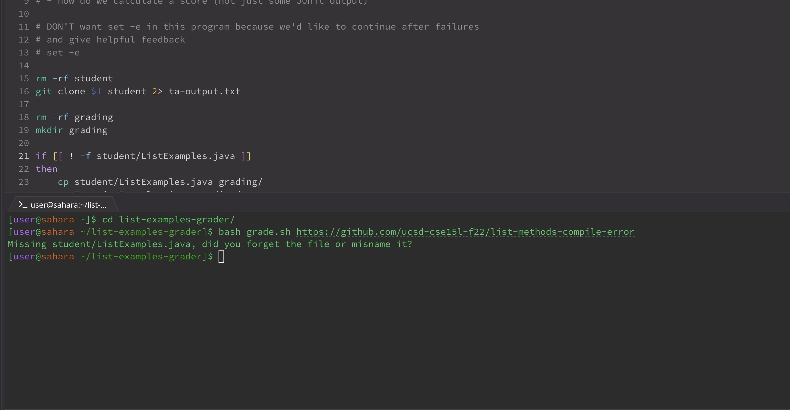

# Lab report 5
---
##student's post
---
*Hi, I was looking back at the code from Wednesday's lecture and trying to 
run it myself. I ran with `bash grade.sh https://github.com/ucsd-cse15l-f22/list-methods-compile-error`,
but the output was not what I expected. The output looks like this:*

*Is there any reason for this?*

---
##reply
---
**

