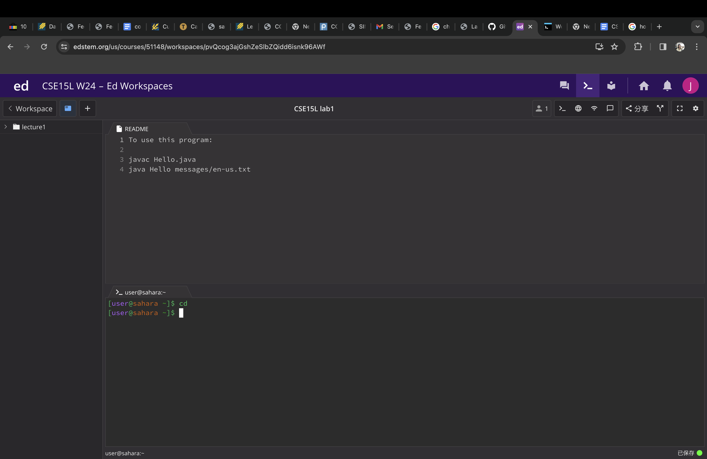
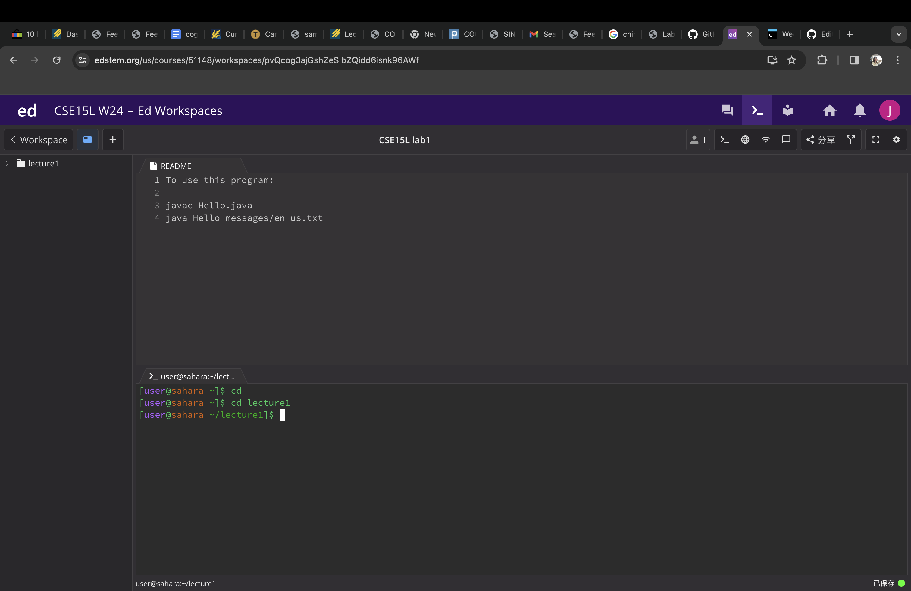
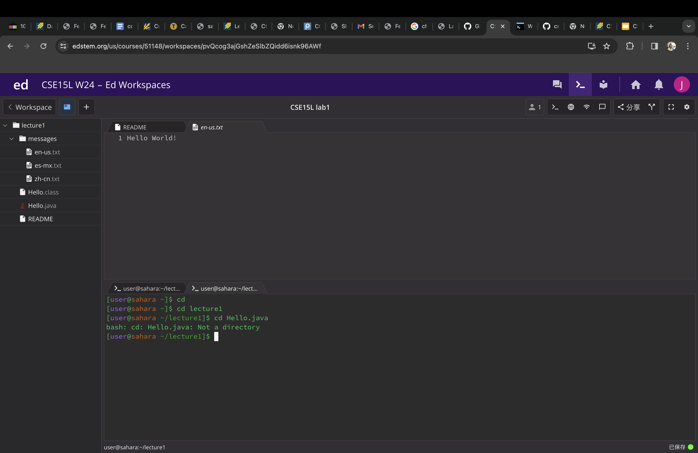
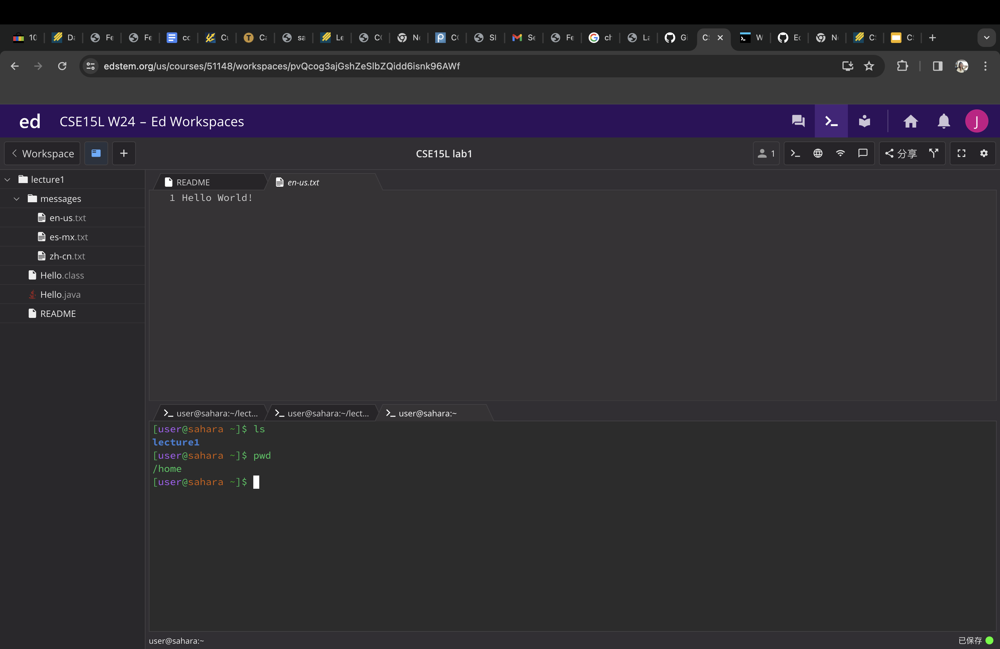
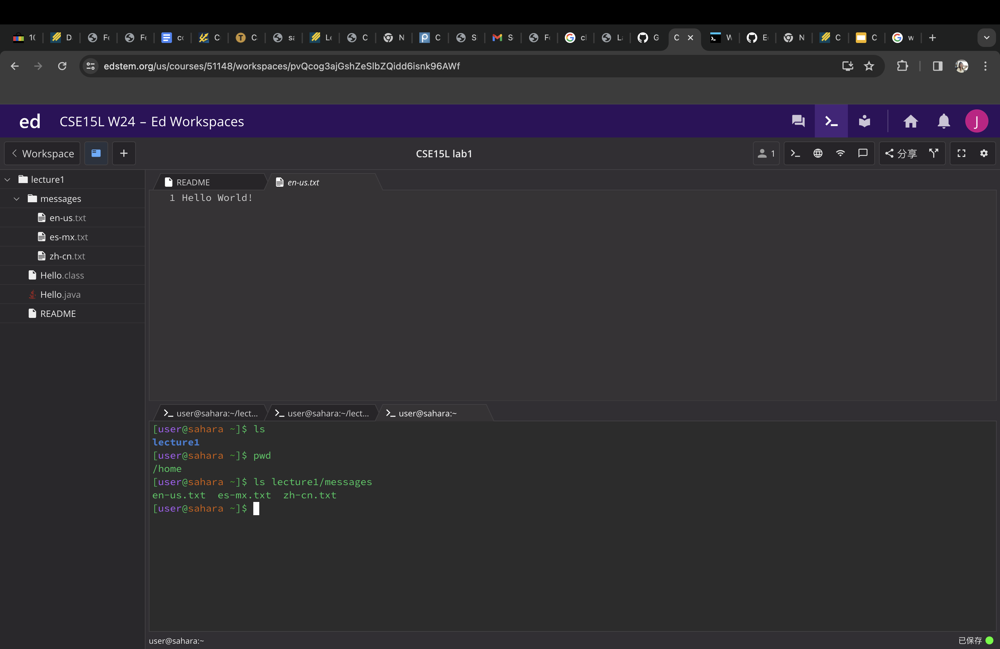
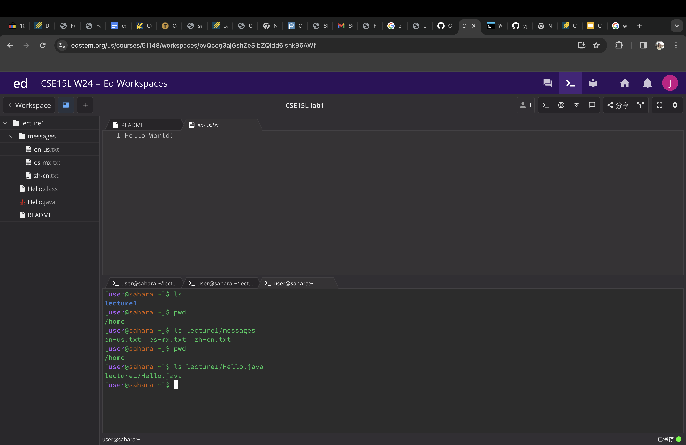
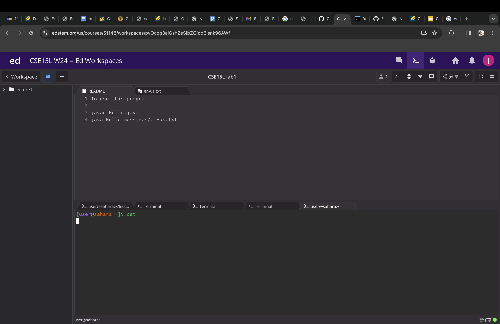
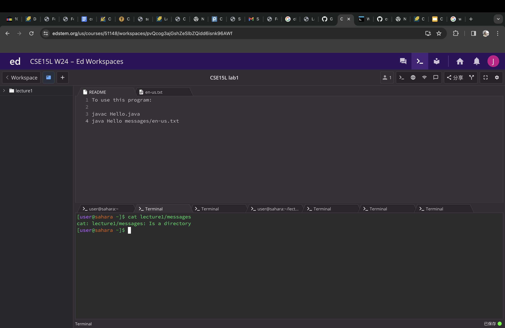
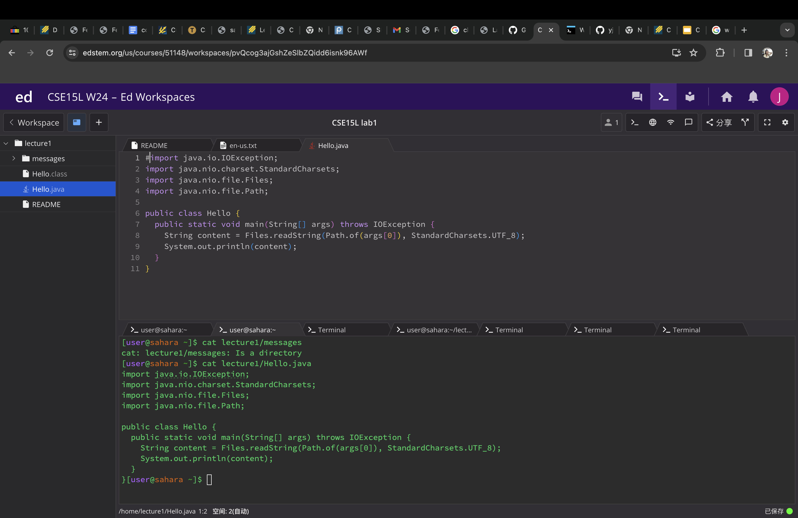

# Lab report 1
##cd using the command with no arguments.

working directory:/home
cd using the commanc with no arguments has no ouputs, it only changes the direction to home

##cd using the command with a directory argument
working directory:/home/lecture1
change current directory to lecture1

##cd using the command with a file argument.
working directory:/home/lecture1/
an error occur becasue cd cannot works for file, it only works for directory

##ls using the command with no arguments.
working directory:/home/lecture1
it list current directory and files

##ls using the command with a directory argument
working directory:/home/lecture1/messages
it list all files under the messages directory

##ls using the command with a file argument.
working directory:/home/lecture1/Hello.java
it list the file under the directory 

##cat using the command with no arguments.
working directory:/home/lecture1
cat with no argument will have a text box as an output, and waiting for user to enter more input

##cat using the command with a directory argument
working directory:/home/lecture1/messages
cat will not take directory as an argument

##cat using the command with a file argument.
working directory:/home/lecture1/Hello.java
it will print the file's content 

